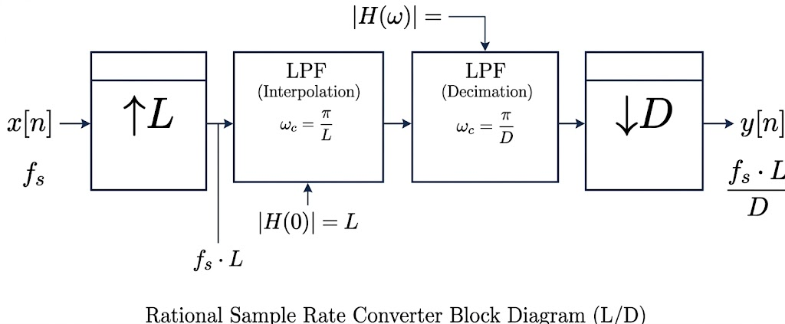
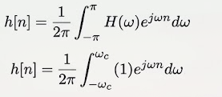
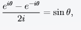
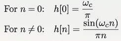
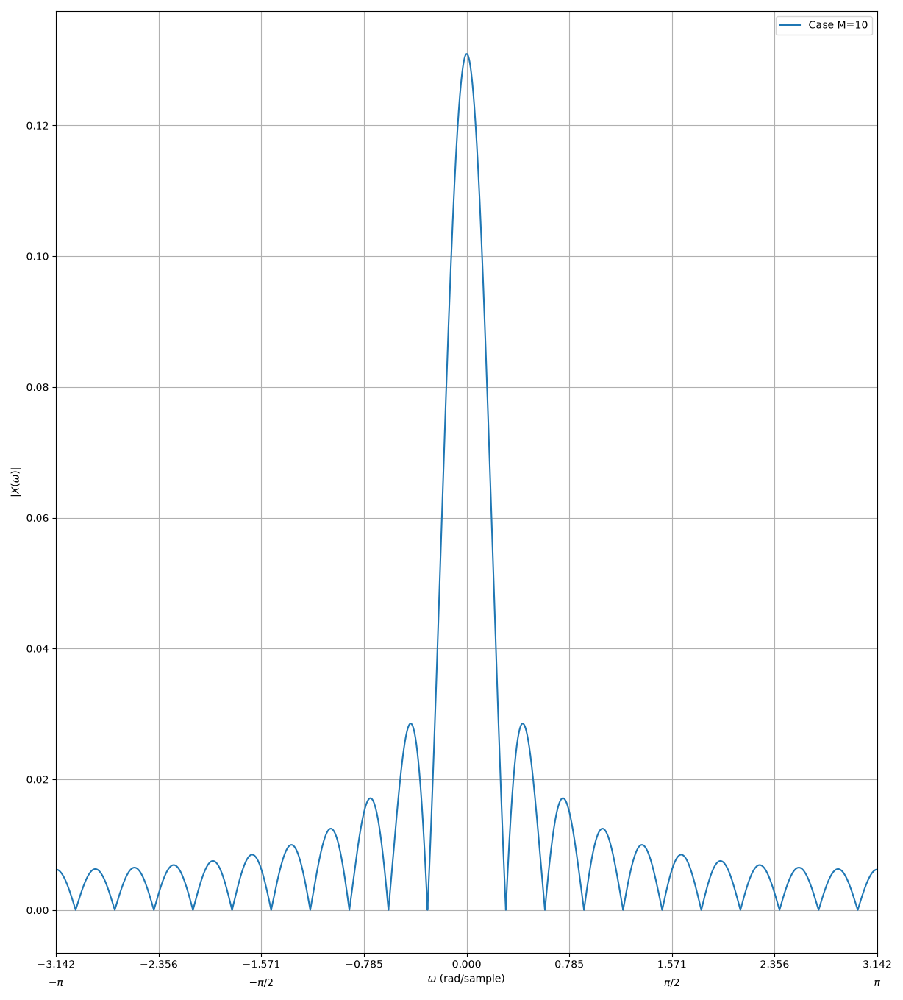
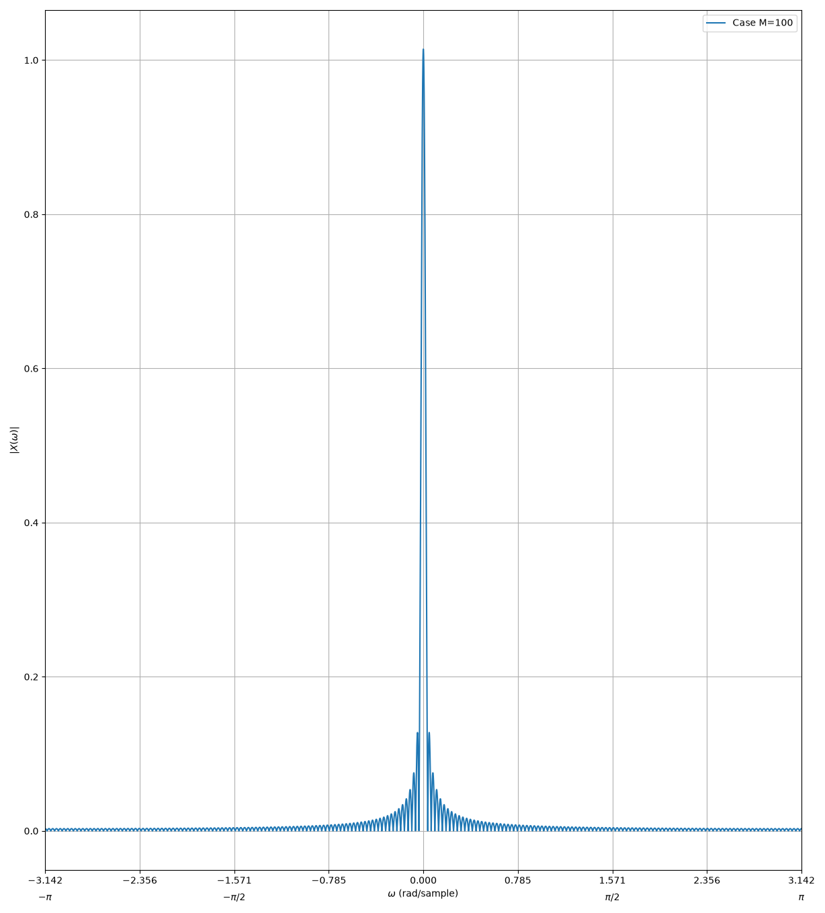
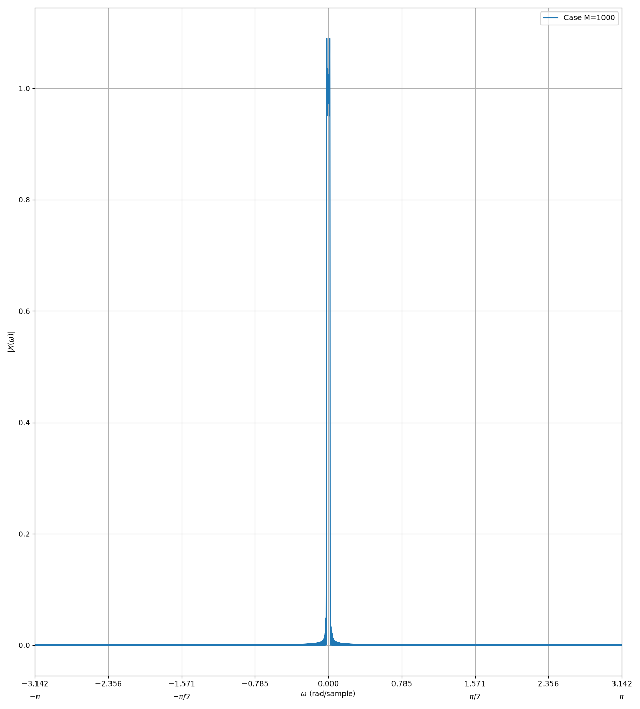
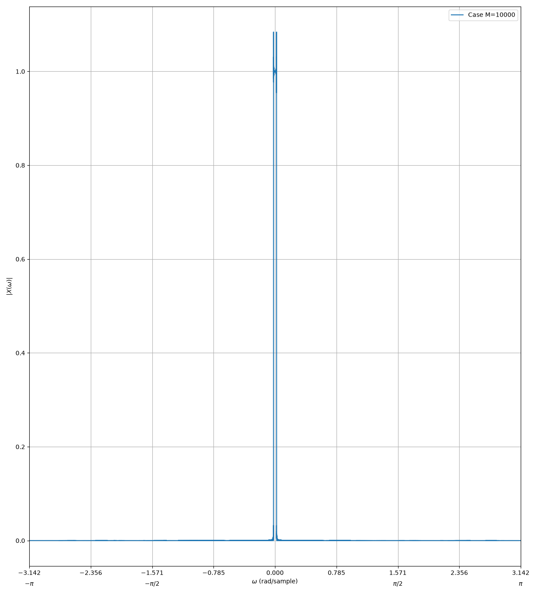

# Multirate Audio Equalizer

## 48 kHz -> 44.1 kHz

**Please sketch the cascaded system of an upsampler by L followed by a down-sampler by D. Is there any way to simplify this system and use one low-pass filter instead of two?**

We can simplify the two LPFs since they are LTI (Linear Time Invariant, we know this since H is defined) so they both operate at frequency fs*L. To satisfy cutoff frequency, we use the minimum of wc/L and wc/D

**Please find the smallest integer values L and D that, when we upsample by L and downsample by D, we convert 48 kHz to 44.1 kHz. (such that L/D = 44100/48000). What sampling rate does the anti-aliasing/anti-imaging filter process data at? If we use a FIR filter with N taps, how many multiplications does this require per second?**

L/D = 44100/48000 simplifies to 147/160. Since we know f = L*fs, and we know fs = 48kHz, f = 7.056 MHz, our filter's sampling rate. With N taps, we multiply by FSR to get 7.056E(6) * N taps per second

**What passband gain do we need from our filter? What cutoff frequency (in both hertz and in radians per sample)?**

Our passband gain is the product of our two individual gains: H_aa * H_ai = H_total -> L * 1 = L, which we know is 147. 

w_c = min(pi/160, pi/147) -> pi/160
In Hz -> (pi/160) * f_sr / 2pi -> fsr / 320 -> 22.05 kHz

**Is this h[n] finite-duration? Is it causal? Do you see any issues implementing this with a computer?**
For n<0, this function is not non-zero, so it is not causal. It is not finite since as n->∞, it does not permanently stay at 0 (rather it decays at 1/n, oscillating around it). Since it is not causal, and inifinite, we
cannot store this function in memory. Since it's not causal, we cannot normally implement a live/real-time version. 
 

 

Using the following sin identity:
 

**Please take the (closed-form, analytical) h[n] you computed in 3.1 and compute its values (in Python or MATLAB) over the range -M <= n <= M, setting M = 10. Plot the DTFT of this function. How does it differ from what you'd expect from an ideal low-pass filter? Examine the DTFT for M = 100, M = 1000, and M = 10000. What effect does increasing M appear to have? What differences still exist between the M = 10000 case and the ideal low-pass filter?**

M = 10 case

M = 100 case

M = 1000 case

M = 10000 case

For low values of M, the transition to the ideal gain (1) is very apparent, and exhibits severe oscillation, creating obvious ripples.
As M->∞, the slope becomes much steeper and the ripples disappear since they oscillate at higher frequency. But even for the M=10000 case, there is overshoot over the ideal gain of 1

**What are two downsides to increasing the number of taps in an FIR filter? For each, explain whether it matters to real-time filtering, non-real-time (offline) filtering, or both.**

The two downsides are increased spacial and time complexity of the program, and introduced latency.

Increased spacial and time complexity of the program applies to both real-time and offline programs since you would have to wait longer for computation in offline programs and for real-time, if you cannot
compute fast enough your program drops samples. Furthermore, for a large number of taps, the program will quickly trigger an out-of-memory exception. 

In terms of latency, the computer atrempts to make the program causal through applying delays. A non-causal system looks like h[n] = h[-n] for -M <= n <= M. To achieve causality, we want h[n] = h[n-M] for 0 <= n <= 2M.

Then, n=0 corresponds to h[-M], while N = 2M corresponds to h[M] so we achieve our same range. 

Since the time per sample is (1/fs), and number of samples = M, our delay = M * 1/fs = M/fs. For a high M, say 10,000 and a sample rate of 48kHz, we see that delay = 0.2s per sample, incredibly high for a song. 

For offline programs, this latency wouldn't really matter since the computer will just wait to process it, increasing computation time but achieving the same result. For a real-time program, we will immediately notice the delay and lost parts of the song.  